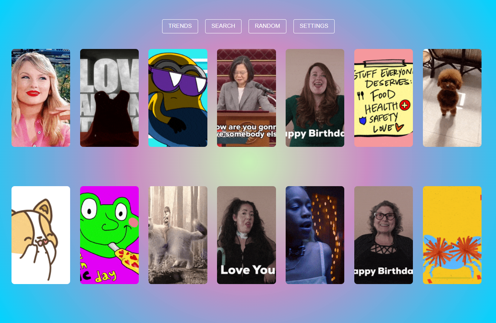
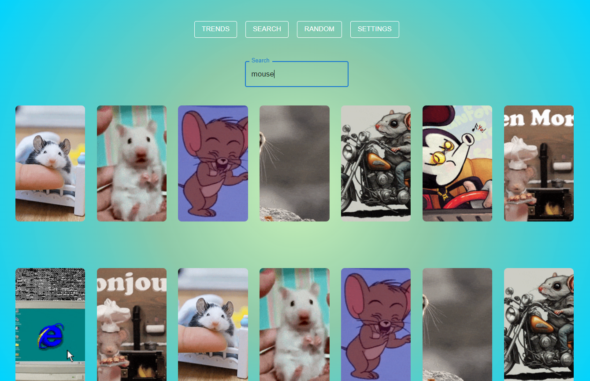
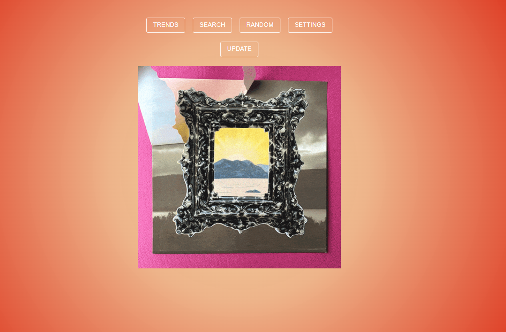

<!-- # Заголовок
рандомный текст  -->
___

  

<!--  -->
## About the project
**Gifs-search** is a web application developed using the Giphy API to display GIFs. It provides various pages and features for convenient interaction with Giphy content.

:point_right: Live demo: [Gifs-search](https://mar1a3.github.io/Gifs-search)
### Technologies:
- Material UI
- styled-components
- react-router
- React
## Screenshots of the Project :camera:

Trends page 👇🏻

  

Search page 👇🏻

  

Random page 👇🏻

  

### Mobile adaptation :iphone:

  

